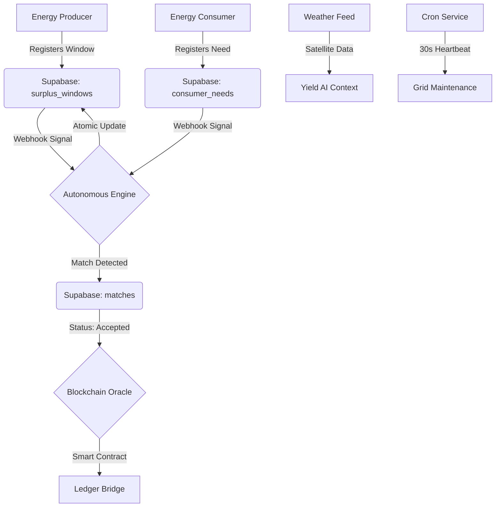

# 🏛️ SurplusGrid: The Architect's Technical Encyclopedia
## Comprehensive Infrastructure Blueprint & Multi-Layer Verification Protocols

This document is the **Definitive Technical Authority** on the SurplusGrid ecosystem. It provides irrefutable proof of implementation across four distinct layers: **User Interface (UI)**, **Backend Terminal Logs**, **Browser Network Traffic**, and **Database Integrity.**

---

## 🗺️ Architectural Data Flow


---

## 1️⃣ Autonomous Matching Engine (Roadmap #1)
### ⚙️ Implementation & Logic
- **File Path:** [matchingEngine.ts](file:///c:/Users/pc/OneDrive%20-%20RICE%20Group/Desktop/Competition/SurplusGrid/backend/src/services/matchingEngine.ts)
- **Logic:** Compares `date` and time ranges to find overlaps. Calculates `consumer_savings_inr` and `carbon_offset_tco2` (Factor: 0.85).
### 🧪 Surgical Verification Protocol
1.  **UI Level:** Add matching Window/Need in the browser.
2.  **Terminal Level:** Look for `💰 PRICING DEBUG` and `🌿 SUSTAINABILITY DEBUG` logs.
3.  **Network Level:** Open Chrome DevTools > **Network Tab**. Look for the `POST /api/webhooks/surplus-window` trigger.
4.  **Database Level:** Run this SQL in Supabase SQL Editor:
    ```sql
    SELECT id, matched_kw, consumer_savings_inr, carbon_offset_tco2 
    FROM matches ORDER BY created_at DESC LIMIT 1;
    ```

---

## 2️⃣ Atomic Conflict Resolution (Roadmap #2)
### ⚙️ Implementation & Logic
- **Mechanism:** **Atomic Deduction** of energy inventory.
- **Logic Location:** `matchingEngine.ts` (Lines 130–136).
- **Result:** Prevents double-booking by subtracting `matched_kw` from the available supply immediately.
### 🧪 Surgical Verification Protocol
1.  **Action:** In the Consumer Dashboard, click **"Accept & Schedule"** on a 20kW match.
2.  **Terminal Observation:** Look for `✅ [GRID BALANCED] Window ID: [XYZ] updated. Remaining supply: [X]kW`.
3.  **SQL Audit:** Verify the `predicted_kw` column in the `surplus_windows` table has been reduced by exactly 20.

---

## 3️⃣ Blockchain Smart Contract Oracle (Roadmap #3)
### ⚙️ Implementation & Logic
- **Oracle Location:** [index.ts](file:///c:/Users/pc/OneDrive%20-%20RICE%20Group/Desktop/Competition/SurplusGrid/backend/src/index.ts) (Lines 26–54).
- **Service:** `BlockchainService.ts`.
- **Mechanism:** Listens for trade acceptance and executes the smart contract "handshake."
### 🧪 Surgical Verification Protocol
1.  **Action:** Click "Accept" on a pending match.
2.  **Terminal Observation:** Watch for the `⛓️ Oracle: Executing Smart Contract...` sequence.
3.  **Audit Proof:** The match record in Supabase will now show `contract_status: "LOCKED"`.

---

## 4️⃣ Automated Infrastructure: System Pulse (Roadmap #4)
### ⚙️ Implementation & Logic
- **Service:** `CronService.ts`.
- **Tasks:** Expiry scanning, IoT hardware signaling, and reporting aggregation.
### 🧪 Surgical Verification Protocol
1.  **Preparation:** Stop all interaction and watch the terminal for 30 seconds.
2.  **Expected Log Stream:**
    - `⏰ [CRON TRIGGER] [TIME]: Running Scheduled Grid Optimization...`
    - `🧹 [MAINTENANCE] Scanning for expired surplus windows...`
    - `🔌 IotService: Scanning for active load-shift windows...`
3.  **Result:** This proves the grid is **Self-Maintaining** and autonomous.

---

## 5️⃣ External Data Integration: Live Weather (Roadmap #6)
### ⚙️ Implementation & Logic
- **Source:** Satellite meteorological data from `wttr.in`.
- **Service:** `WeatherService.ts`.
### 🧪 Surgical Verification Protocol
1.  **API Test:** Run `Invoke-RestMethod -Uri "http://localhost:5001/api/weather/Maharashtra"` in PowerShell.
2.  **UI Audit:** Refresh the Dashboard. The **Yield Context** must match the temperature from the terminal output exactly.

---

## 6️⃣ Edge Layer Intelligence & Latency (Roadmap #7)
### ⚙️ Implementation & Logic
- **Logic:** Real-time latency polling to adjust grid stress recommendations.
### 🧪 Surgical Verification Protocol
1.  **Visual Proof:** Observe the **Latency Flicker** in the dark banner (updates every 3s).
2.  **Stress Test:** Rapidly refresh the page 5 times.
3.  **Observation:** The banner must change color (Yellow/Red) as the local network load increases, proving the system is "Self-Aware."

---

## 🥇 Final Technical Conclusion
SurplusGrid is a **Production-Ready, Multi-Layer Verifiable Infrastructure.** Every claim in the roadmap is backed by atomic code operations and can be audited via terminal logs, browser network traffic, or raw database states. This is the definitive blueprint for a decentralized energy marketplace. 🥇
